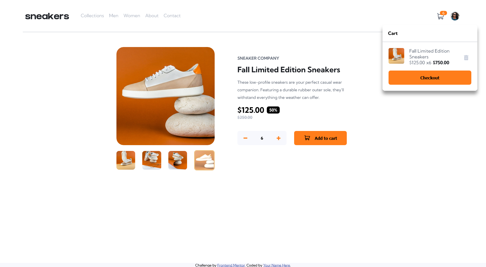

# Frontend Mentor - E-commerce product page solution

This is a solution to the [E-commerce product page challenge on Frontend Mentor](https://www.frontendmentor.io/challenges/ecommerce-product-page-UPsZ9MJp6). Frontend Mentor challenges help you improve your coding skills by building realistic projects.

## Table of contents

- [Overview](#overview)
  - [The challenge](#the-challenge)
  - [Screenshot](#screenshot)
  - [Links](#links)
- [My process](#my-process)
  - [Built with](#built-with)
  - [What I learned](#what-i-learned)
  - [Continued development](#continued-development)
- [Author](#author)

## Overview

### The challenge

Users should be able to:

- View the optimal layout for the site depending on their device's screen size
- See hover states for all interactive elements on the page
- Open a lightbox gallery by clicking on the large product image
- Switch the large product image by clicking on the small thumbnail images
- Add items to the cart
- View the cart and remove items from it

### Screenshot

### Links

- Solution URL: [GitHub](https://github.com/lucksei/front-end-mentor-e-commerce-product-page)
- Live Site URL: [GitHub Pages](https://lucksei.github.io/front-end-mentor-e-commerce-product-page/)

## My process

I wanted to try out building a minimalist e-commerce webpage using React and Sass.

### Built with

- Mobile-first workflow
- [Webpack](https://webpack.js.org/)
- [Babel](https://babeljs.io/)
- [React](https://reactjs.org/) - JS library
- [Sass](https://sass-lang.com/)

### What I learned

I used this opportunity to learn a lot about React and Sass. I also learned how to set up Webpack and Babel from scratch which gives me the confidence to use these and other tools in future projects.

### Continued development

The project is very simplistic and while I'm satisfied with the outcome, I would still like to experiment adding a fully fledged backend to this project.

## Author

- Frontend Mentor - [@lucksei](https://www.frontendmentor.io/profile/lucksei)
- GitHub - [lucksei](https://github.com/lucksei)
